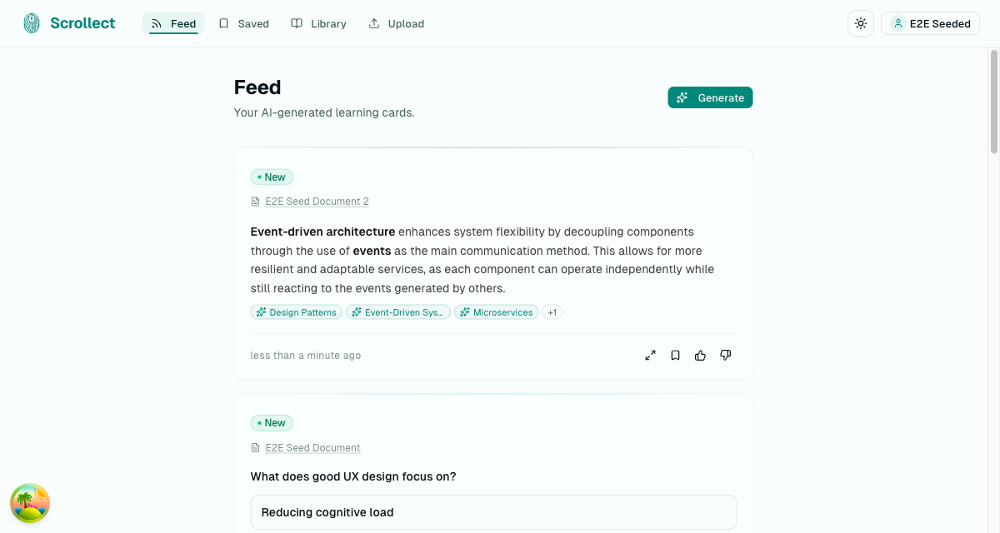
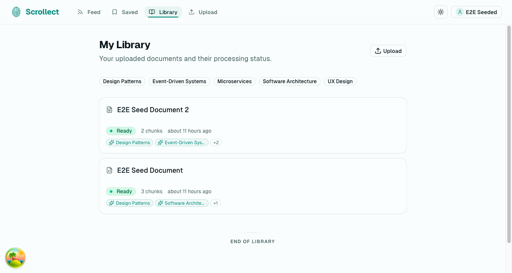
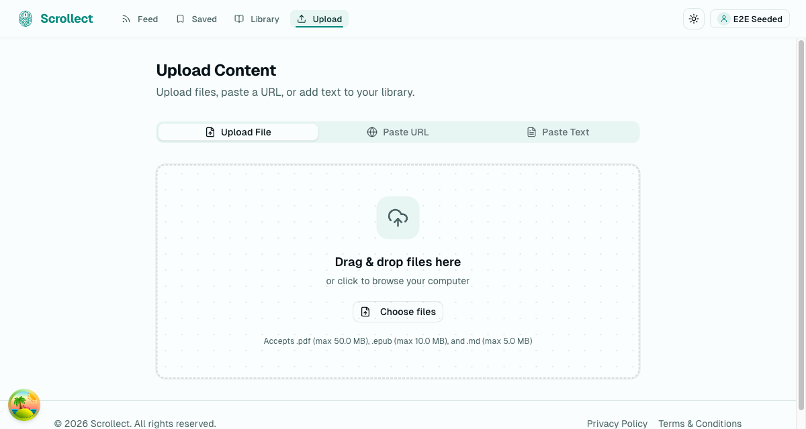

<p align="center">
  <picture>
    <source media="(prefers-color-scheme: dark)" srcset="apps/web/public/icon-dark.svg" />
    <source media="(prefers-color-scheme: light)" srcset="apps/web/public/icon.svg" />
    
  </picture>
</p>

<p align="center">
  <strong>AI-powered personal learning feed.</strong><br/>
  Transform your saved content into a scrollable feed of bite-sized learning cards - like social media, but built from your own knowledge.
</p>

<p align="center">
  <a href="LICENSE"></a>
</p>

---

## The Problem

You read books, watch talks, save articles, bookmark videos - and forget 90% of it within a week. Your browser bookmarks are a graveyard of good intentions.

Scrollect fixes that.

## What It Does

Scrollect turns your saved content into a personal learning feed you actually want to scroll:

- **Upload anything** - books, articles, YouTube videos, PDFs
- **AI breaks it down** - content is transformed into bite-sized learning cards by a dedicated AI agent
- **Scroll to learn** - browse your personal feed daily to retain what you've read
- **Connect the dots** - cards surface connections across your entire knowledge base

Personal, not social. No followers, no comments, no public profiles. Just you and your knowledge.

## Screenshots

<p align="center">
  
  <br/>
  <em>Your personal learning feed with AI-generated cards</em>
</p>

<p align="center">
  
  <br/>
  <em>Library view with uploaded documents and topic tags</em>
</p>

<p align="center">
  
  <br/>
  <em>Upload files, paste URLs, or add text in seconds</em>
</p>

## Getting Started

### Prerequisites

- [Bun](https://bun.sh/) >= 1.3.3
- A [Convex](https://convex.dev/) account (free tier works)

### Installation

```bash
git clone https://github.com/jagoral/scrollect.git
cd scrollect
bun install
```

### Setup Convex Backend

Scrollect uses [Convex](https://convex.dev/) as its real-time backend. Run the setup wizard:

```bash
bun run dev:setup
```

Follow the prompts to create a new Convex project. Then copy the environment variables:

```bash
cp packages/backend/.env.local apps/web/.env
```

### Run

```bash
bun run dev
```

Open [http://localhost:3000](http://localhost:3000) to see the app.

## Tech Stack

| Layer     | Technology                                                                        |
| --------- | --------------------------------------------------------------------------------- |
| Monorepo  | [Turborepo](https://turbo.build/) + [Bun](https://bun.sh/)                        |
| Frontend  | [TanStack Start](https://tanstack.com/start)                                      |
| Backend   | [Convex](https://convex.dev/)                                                     |
| Auth      | [Better-Auth](https://better-auth.com/)                                           |
| UI        | [shadcn/ui](https://ui.shadcn.com/) + [Tailwind CSS v4](https://tailwindcss.com/) |
| Linting   | [Oxlint](https://oxc.rs/) + Oxfmt                                                 |
| E2E Tests | [Playwright](https://playwright.dev/)                                             |
| Docs      | [Astro Starlight](https://starlight.astro.build/)                                 |

## Project Structure

```
scrollect/
  apps/
    web/              # Frontend application (TanStack Start)
    docs/             # Documentation site (Astro Starlight)
    e2e/              # End-to-end tests (Playwright)
    presentation/     # Project presentation (Slidev)
  packages/
    backend/          # Convex backend (functions, schema, AI pipeline)
    config/           # Shared configuration
    env/              # Shared environment validation
```

## Scripts

| Command              | Description                        |
| -------------------- | ---------------------------------- |
| `bun run dev`        | Start all apps in development mode |
| `bun run build`      | Build all apps                     |
| `bun run dev:web`    | Start only the web app             |
| `bun run dev:server` | Start only the Convex backend      |
| `bun run dev:setup`  | Setup and configure Convex         |
| `bun run check`      | Run Oxlint and Oxfmt               |
| `bun run test:e2e`   | Run end-to-end tests               |

## Contributing

Contributions are welcome! Please open an issue first to discuss what you'd like to change.

1. Fork the repository
2. Create your feature branch (`git checkout -b feat/your-feature`)
3. Commit your changes
4. Push to the branch and open a Pull Request

## License

Scrollect is licensed under the [GNU Affero General Public License v3.0](LICENSE).

You are free to fork, modify, and use this software for personal purposes. If you deploy a modified version as a service, you must make your source code available under the same license.
