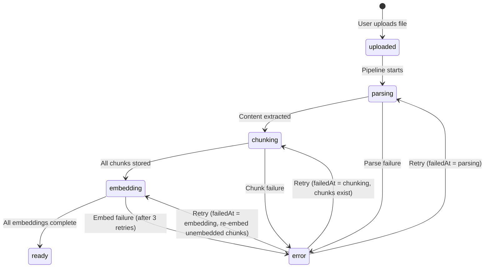
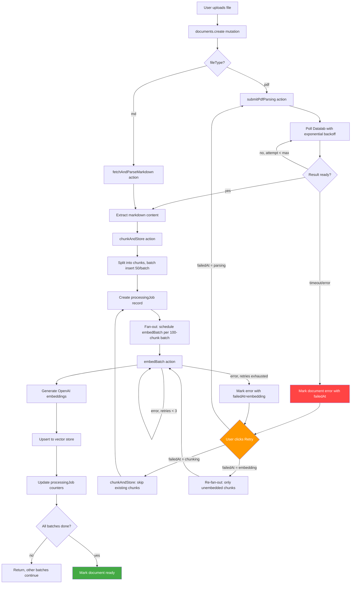
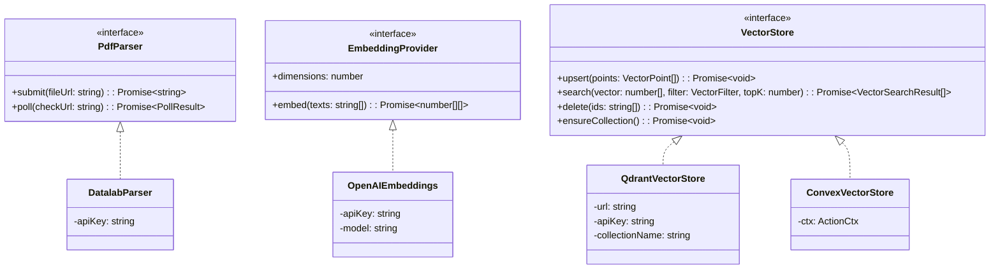
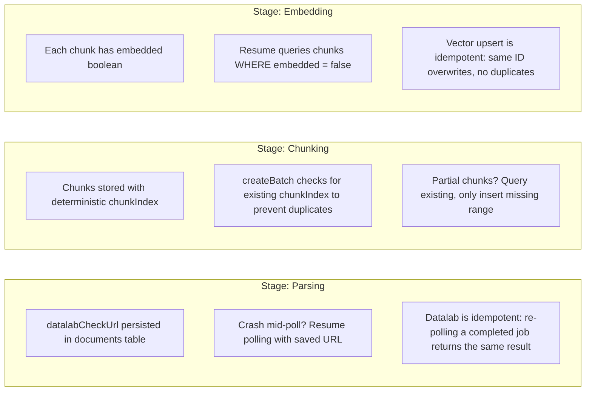

# ADR-001: All-in-Convex Document Processing

**Status:** Proposed
**Date:** 2026-03-07
**Author:** Scrollect Team

## Context

Scrollect's document processing pipeline is currently split across two deployments:

1. **Convex backend** (`packages/backend/convex/`) — state management, scheduling, some embedding logic
2. **Hono/Vercel app** (`apps/processing/`) — PDF parsing, chunking, embedding orchestration

This split introduces several problems:

| Problem                          | Detail                                                                                                                                                                                                                 |
| -------------------------------- | ---------------------------------------------------------------------------------------------------------------------------------------------------------------------------------------------------------------------- | ---------- | ----- | ------------------------------------------------------------------------------------- |
| **Split deployment**             | Two services to deploy, monitor, and keep in sync. The processing app duplicates chunking logic from `chunking.ts`.                                                                                                    |
| **Duplicated logic**             | `chunkContent()` and `chunkMarkdown()` exist in both `packages/backend/convex/chunking.ts` and `apps/processing/api/process.ts`.                                                                                       |
| **Fragile completion detection** | The processing app fires embedding batches as fire-and-forget `fetch()` calls. The last batch to finish marks the document as `ready`, but if any batch fails silently, the document is stuck in `processing` forever. |
| **No progress tracking**         | Users see `pending                                                                                                                                                                                                     | processing | ready | error` with no granularity. There is no way to know if a document is 10% or 90% done. |
| **No resumability**              | If any step fails (Datalab timeout, OpenAI rate limit, Qdrant downtime), the entire document is stuck. There is no way to resume from the last successful step — the user must re-upload.                              |
| **Memory pressure**              | The Vercel serverless function accumulates the full markdown in memory before chunking. For 100MB+ PDFs with dense text this can exceed memory limits.                                                                 |
| **Tight coupling via HTTP**      | Convex calls the processing app via `fetch()`, which calls Convex back via HTTP routes with a shared `PROCESSING_SECRET`. This creates a fragile bidirectional dependency.                                             |
| **Duplicated credentials**       | `OPENAI_API_KEY`, `QDRANT_URL`, and `QDRANT_API_KEY` are configured in both Convex and the processing app.                                                                                                             |

## Decision

**Move all document processing into Convex.** Delete `apps/processing/` entirely.

Convex actions provide sufficient compute for every stage of the pipeline. By leveraging Convex's built-in scheduler, internal functions, and action retries, we eliminate the bidirectional HTTP coupling, duplicated logic, and fragile completion detection.

Breaking changes are acceptable. No migration from the current schema is needed.

---

## Document State Machine



**States:**

| State       | Description                                                                       |
| ----------- | --------------------------------------------------------------------------------- |
| `uploaded`  | File stored in Convex, no processing started                                      |
| `parsing`   | PDF submitted to Datalab or markdown being fetched                                |
| `chunking`  | Content is being split into chunks and stored                                     |
| `embedding` | Chunks are being embedded in batches                                              |
| `ready`     | All chunks embedded, document is searchable                                       |
| `error`     | Processing failed; `errorMessage` and `failedAt` record what went wrong and where |

**Resume behavior:** When a user retries a failed document, `pipeline.resumeProcessing` reads `documents.failedAt` to decide which stage to re-enter. It never re-does work that already succeeded.

---

## Pipeline Flow



---

## Schema

Clean-break schema. No migration from current tables.

```typescript
// packages/backend/convex/schema.ts
import { defineSchema, defineTable } from "convex/server";
import { v } from "convex/values";

export default defineSchema({
  documents: defineTable({
    title: v.string(),
    fileType: v.union(v.literal("pdf"), v.literal("md")),
    storageId: v.id("_storage"),
    status: v.union(
      v.literal("uploaded"),
      v.literal("parsing"),
      v.literal("chunking"),
      v.literal("embedding"),
      v.literal("ready"),
      v.literal("error"),
    ),
    errorMessage: v.optional(v.string()),
    // Records which stage failed so retry can resume from the right point
    failedAt: v.optional(
      v.union(v.literal("parsing"), v.literal("chunking"), v.literal("embedding")),
    ),
    // Persisted so polling can resume after a parsing crash
    datalabCheckUrl: v.optional(v.string()),
    chunkCount: v.number(),
    userId: v.string(),
    createdAt: v.number(),
  })
    .index("by_userId", ["userId"])
    .index("by_status", ["status"]),

  chunks: defineTable({
    documentId: v.id("documents"),
    content: v.string(),
    chunkIndex: v.number(),
    tokenCount: v.number(),
    // Track per-chunk embedding state for resumability
    embedded: v.boolean(), // false until vector store confirms upsert
    embeddingId: v.optional(v.string()), // Qdrant point ID or Convex vector ID
    createdAt: v.number(),
  })
    .index("by_documentId", ["documentId"])
    .index("by_documentId_unembedded", ["documentId", "embedded"]),

  processingJobs: defineTable({
    documentId: v.id("documents"),
    totalBatches: v.number(),
    completedBatches: v.number(),
    failedBatches: v.number(),
    retryCount: v.number(),
    createdAt: v.number(),
  }).index("by_documentId", ["documentId"]),

  posts: defineTable({
    content: v.string(),
    assetStorageId: v.optional(v.id("_storage")), // optional image/diagram/etc.
    sourceChunkId: v.id("chunks"),
    sourceDocumentId: v.id("documents"),
    userId: v.string(),
    saved: v.optional(v.boolean()), // user bookmarked this card
    reaction: v.optional(
      v.union(
        // user feedback
        v.literal("like"),
        v.literal("dislike"),
      ),
    ),
    createdAt: v.number(),
  })
    .index("by_userId", ["userId"])
    .index("by_saved", ["userId", "saved"]),
});
```

**Key changes from current schema:**

| Change                                          | Rationale                                                            |
| ----------------------------------------------- | -------------------------------------------------------------------- |
| `documents.status` expanded to 6 states         | Granular progress tracking through the pipeline                      |
| `documents.failedAt` added                      | Records which stage failed so retry resumes from the right point     |
| `documents.datalabCheckUrl` added               | Persists Datalab polling URL so parsing can resume after a crash     |
| `chunks.embedded` boolean added                 | Per-chunk tracking enables resuming embedding from where it left off |
| `chunks.qdrantPointId` renamed to `embeddingId` | Provider-agnostic naming                                             |
| `chunks` index `by_documentId_unembedded`       | Efficiently query "which chunks still need embedding?" for resume    |
| New `processingJobs` table                      | Batch-level progress counters for fan-out/fan-in tracking            |
| `documents.status` index added                  | Query documents by processing state                                  |

---

## Provider Abstraction



### TypeScript Interfaces

```typescript
// packages/backend/convex/providers/types.ts

// --- PDF Parser ---

export interface PollResult {
  status: "pending" | "complete" | "error";
  markdown?: string;
  errorMessage?: string;
}

export interface PdfParser {
  /** Submit a PDF for parsing. Returns a check URL for polling. */
  submit(fileUrl: string): Promise<string>;

  /** Poll for parsing result. */
  poll(checkUrl: string): Promise<PollResult>;
}

// --- Embedding Provider ---

export interface EmbeddingProvider {
  /** The dimensionality of the embedding vectors. */
  readonly dimensions: number;

  /** Generate embeddings for a batch of texts. Returns one vector per input text. */
  embed(texts: string[]): Promise<number[][]>;
}

// --- Vector Store ---

export interface VectorPoint {
  id: string;
  vector: number[];
  payload: {
    chunkId: string;
    documentId: string;
    chunkIndex: number;
    userId: string;
  };
}

export interface VectorFilter {
  userId: string;
}

export interface VectorSearchResult {
  id: string;
  score: number;
  payload: VectorPoint["payload"];
}

export interface VectorStore {
  /** Ensure the backing collection/index exists. Idempotent. */
  ensureCollection(): Promise<void>;

  /** Upsert vectors. Overwrites existing points with the same ID. */
  upsert(points: VectorPoint[]): Promise<void>;

  /** Search for similar vectors, filtered by userId. */
  search(vector: number[], filter: VectorFilter, topK: number): Promise<VectorSearchResult[]>;

  /** Delete vectors by ID. */
  delete(ids: string[]): Promise<void>;
}
```

### Concrete Implementations

```typescript
// packages/backend/convex/providers/datalab.ts

import { PdfParser, PollResult } from "./types";

export class DatalabParser implements PdfParser {
  private apiKey: string;

  constructor(apiKey: string) {
    this.apiKey = apiKey;
  }

  async submit(fileUrl: string): Promise<string> {
    const formData = new FormData();
    formData.append("file_url", fileUrl);
    formData.append("output_format", "markdown");
    formData.append("mode", "accurate");
    formData.append("disable_image_extraction", "true");

    const response = await fetch("https://www.datalab.to/api/v1/convert", {
      method: "POST",
      headers: { "X-API-Key": this.apiKey },
      body: formData,
    });

    if (!response.ok) {
      const errorText = await response.text();
      throw new Error(`Datalab submit failed: ${response.status} ${errorText}`);
    }

    const data = await response.json();
    if (!data.success || !data.request_check_url) {
      throw new Error(`Datalab submit failed: ${JSON.stringify(data)}`);
    }
    return data.request_check_url;
  }

  async poll(checkUrl: string): Promise<PollResult> {
    const response = await fetch(checkUrl, {
      headers: { "X-API-Key": this.apiKey },
    });

    if (!response.ok) {
      throw new Error(`Datalab poll failed: ${response.status}`);
    }

    const data = await response.json();
    if (data.status === "complete") {
      if (!data.success) {
        return { status: "error", errorMessage: data.error ?? "Datalab conversion failed" };
      }
      const markdown = data.markdown?.trim();
      if (!markdown) {
        return { status: "error", errorMessage: "No text content could be extracted from the PDF" };
      }
      return { status: "complete", markdown };
    }
    if (data.status === "error") {
      return { status: "error", errorMessage: data.error ?? "Datalab parsing failed" };
    }
    return { status: "pending" };
  }
}
```

```typescript
// packages/backend/convex/providers/openai.ts

import { EmbeddingProvider } from "./types";

export class OpenAIEmbeddings implements EmbeddingProvider {
  private apiKey: string;
  private model: string;
  readonly dimensions: number = 1536;

  constructor(apiKey: string, model: string = "text-embedding-3-small") {
    this.apiKey = apiKey;
    this.model = model;
  }

  async embed(texts: string[]): Promise<number[][]> {
    const response = await fetch("https://api.openai.com/v1/embeddings", {
      method: "POST",
      headers: {
        Authorization: `Bearer ${this.apiKey}`,
        "Content-Type": "application/json",
      },
      body: JSON.stringify({ input: texts, model: this.model }),
    });
    const data = await response.json();
    if (!response.ok) {
      throw new Error(`OpenAI embedding failed: ${JSON.stringify(data)}`);
    }
    return data.data
      .sort((a: { index: number }, b: { index: number }) => a.index - b.index)
      .map((d: { embedding: number[] }) => d.embedding);
  }
}
```

```typescript
// packages/backend/convex/providers/qdrant.ts

import { QdrantClient } from "@qdrant/js-client-rest";
import { VectorStore, VectorPoint, VectorFilter, VectorSearchResult } from "./types";

const COLLECTION_NAME = "scrollect_chunks";
const VECTOR_SIZE = 1536;

export class QdrantVectorStore implements VectorStore {
  private client: QdrantClient;

  constructor(url: string, apiKey: string) {
    this.client = new QdrantClient({ url, apiKey });
  }

  async ensureCollection(): Promise<void> {
    const collections = await this.client.getCollections();
    const exists = collections.collections.some((c) => c.name === COLLECTION_NAME);
    if (!exists) {
      await this.client.createCollection(COLLECTION_NAME, {
        vectors: { size: VECTOR_SIZE, distance: "Cosine" },
      });
    }
  }

  async upsert(points: VectorPoint[]): Promise<void> {
    await this.client.upsert(COLLECTION_NAME, {
      wait: true,
      points: points.map((p) => ({
        id: p.id,
        vector: p.vector,
        payload: p.payload,
      })),
    });
  }

  async search(
    vector: number[],
    filter: VectorFilter,
    topK: number,
  ): Promise<VectorSearchResult[]> {
    const results = await this.client.search(COLLECTION_NAME, {
      vector,
      limit: topK,
      filter: {
        must: [{ key: "userId", match: { value: filter.userId } }],
      },
      with_payload: true,
    });
    return results.map((r) => ({
      id: r.id as string,
      score: r.score,
      payload: r.payload as VectorPoint["payload"],
    }));
  }

  async delete(ids: string[]): Promise<void> {
    await this.client.delete(COLLECTION_NAME, {
      wait: true,
      points: ids,
    });
  }
}
```

---

## Vector Store Decision

Two viable options for the `VectorStore` implementation:

### Option A: Qdrant (current)

```typescript
// packages/backend/convex/providers/qdrant.ts
// (Full implementation shown above)
```

| Aspect          | Detail                                                   |
| --------------- | -------------------------------------------------------- |
| **Maturity**    | Production-grade, purpose-built vector DB                |
| **Filtering**   | Rich payload filtering (by userId, documentId, metadata) |
| **Scalability** | Handles millions of vectors with sharding                |
| **Cost**        | Separate hosted service (Qdrant Cloud) or self-hosted    |
| **Latency**     | Extra network hop from Convex action to Qdrant           |
| **Ops burden**  | Separate service to monitor, backup, and scale           |

### Option B: Convex Native Vector Search

```typescript
// packages/backend/convex/providers/convexVectors.ts

import { VectorStore, VectorPoint, VectorFilter, VectorSearchResult } from "./types";
import { ActionCtx } from "../_generated/server";
import { api, internal } from "../_generated/api";

export class ConvexVectorStore implements VectorStore {
  private ctx: ActionCtx;

  constructor(ctx: ActionCtx) {
    this.ctx = ctx;
  }

  async ensureCollection(): Promise<void> {
    // No-op: Convex vector indexes are defined in the schema
  }

  async upsert(points: VectorPoint[]): Promise<void> {
    // Store embeddings directly in the chunks table via internal mutation
    await this.ctx.runMutation(internal.vectorMutations.upsertEmbeddings, {
      points: points.map((p) => ({
        chunkId: p.payload.chunkId as any,
        embedding: p.vector,
      })),
    });
  }

  async search(
    vector: number[],
    filter: VectorFilter,
    topK: number,
  ): Promise<VectorSearchResult[]> {
    // Use Convex vectorSearch API
    const results = await this.ctx.vectorSearch("chunks", "by_embedding", {
      vector,
      limit: topK,
      filter: (q) => q.eq("userId", filter.userId),
    });
    return results.map((r) => ({
      id: r._id,
      score: r._score,
      payload: {
        chunkId: r._id,
        documentId: r.documentId,
        chunkIndex: r.chunkIndex,
        userId: filter.userId,
      },
    }));
  }

  async delete(ids: string[]): Promise<void> {
    // Delete chunk records; embeddings are stored inline
    await this.ctx.runMutation(internal.vectorMutations.deleteChunks, {
      chunkIds: ids as any[],
    });
  }
}
```

**Schema addition for Convex vectors:**

```typescript
chunks: defineTable({
  // ... existing fields ...
  embedding: v.optional(v.array(v.float64())),
  userId: v.string(), // denormalized for vector search filtering
})
  .index("by_documentId", ["documentId"])
  .vectorIndex("by_embedding", {
    vectorField: "embedding",
    dimensions: 1536,
    filterFields: ["userId"],
  }),
```

| Aspect          | Detail                                                                   |
| --------------- | ------------------------------------------------------------------------ |
| **Maturity**    | GA in Convex, but newer than Qdrant                                      |
| **Filtering**   | Limited to fields declared in `filterFields`                             |
| **Scalability** | Convex-managed, scales with your plan                                    |
| **Cost**        | Included in Convex pricing (no extra service)                            |
| **Latency**     | Zero network hop — same infrastructure                                   |
| **Ops burden**  | Zero — fully managed alongside your backend                              |
| **Storage**     | Embeddings stored inline in chunks table (1536 floats = ~12KB per chunk) |

### Trade-off Summary

| Criterion             | Qdrant                    | Convex Native              |
| --------------------- | ------------------------- | -------------------------- |
| Setup complexity      | Higher (separate service) | Lower (schema only)        |
| Filtering flexibility | Rich payload filters      | Limited to declared fields |
| Operational overhead  | Medium                    | None                       |
| Network latency       | Extra hop                 | Zero                       |
| Cost at scale         | Separate billing          | Included                   |
| Vendor lock-in        | Portable                  | Convex-specific            |
| Max vector count      | Millions+                 | Convex plan limits         |

**Recommendation:** Start with Convex native vector search for simplicity. The `VectorStore` interface makes it easy to swap to Qdrant if filtering or scale requirements grow.

---

## Batch Processing

### Chunking Batches

Content is split into chunks and stored in batches of **50 chunks** per mutation call. This keeps individual mutation payloads small and avoids Convex's 8MB argument size limit.

```typescript
// Inside chunkAndStore action
const CHUNK_STORE_BATCH_SIZE = 50;

const allChunks = chunkMarkdown(markdownContent);
let storedChunkIds: Id<"chunks">[] = [];

for (let i = 0; i < allChunks.length; i += CHUNK_STORE_BATCH_SIZE) {
  const batch = allChunks.slice(i, i + CHUNK_STORE_BATCH_SIZE);
  const ids = await ctx.runMutation(internal.chunks.createBatch, {
    documentId,
    chunks: batch,
  });
  storedChunkIds.push(...ids);
}
```

### Embedding Fan-out / Fan-in

Embedding uses a **fan-out/fan-in** pattern with **100 chunks per batch**:

1. **Fan-out:** `chunkAndStore` creates a `processingJob` record and schedules one `embedBatch` action per 100-chunk batch.
2. **Execute:** Each `embedBatch` generates embeddings and upserts to the vector store independently.
3. **Fan-in:** Each `embedBatch` atomically increments `processingJob.completedBatches` (or `failedBatches`). When `completedBatches + failedBatches === totalBatches`, the last batch to finish marks the document as `ready` (or `error` if any batch failed).

```typescript
// Fan-out scheduling
const EMBED_BATCH_SIZE = 100;
const totalBatches = Math.ceil(storedChunkIds.length / EMBED_BATCH_SIZE);

const jobId = await ctx.runMutation(internal.processingJobs.create, {
  documentId,
  totalBatches,
});

for (let i = 0; i < storedChunkIds.length; i += EMBED_BATCH_SIZE) {
  const batchChunkIds = storedChunkIds.slice(i, i + EMBED_BATCH_SIZE);
  await ctx.scheduler.runAfter(0, internal.pipeline.embedBatch, {
    jobId,
    documentId,
    chunkIds: batchChunkIds,
    retryCount: 0,
  });
}
```

```typescript
// Fan-in completion check (inside embedBatch action)
const job = await ctx.runMutation(internal.processingJobs.markBatchComplete, {
  jobId,
  success: true, // or false on failure
});

if (job.completedBatches + job.failedBatches === job.totalBatches) {
  const finalStatus = job.failedBatches > 0 ? "error" : "ready";
  await ctx.runMutation(internal.documents.updateStatus, {
    documentId,
    status: finalStatus,
    errorMessage:
      job.failedBatches > 0
        ? `${job.failedBatches}/${job.totalBatches} embedding batches failed`
        : undefined,
  });
}
```

### Retry Logic

Each `embedBatch` retries up to **3 times** with exponential backoff:

```typescript
const MAX_RETRIES = 3;

// Inside embedBatch action, on error:
if (retryCount < MAX_RETRIES) {
  const delayMs = Math.pow(2, retryCount) * 1000; // 1s, 2s, 4s
  await ctx.scheduler.runAfter(delayMs, internal.pipeline.embedBatch, {
    jobId,
    documentId,
    chunkIds,
    retryCount: retryCount + 1,
  });
  return; // Don't mark batch as failed yet
}

// Retries exhausted — mark batch as failed
await ctx.runMutation(internal.processingJobs.markBatchComplete, {
  jobId,
  success: false,
});
```

---

## Polling Strategy

Datalab PDF parsing is asynchronous. Instead of polling at a fixed 5-second interval (current: 60 attempts x 5s = 300s), use **exponential backoff** to reduce action invocations:

```typescript
const INITIAL_DELAY_MS = 5_000; // 5 seconds
const MAX_DELAY_MS = 40_000; // 40 seconds
const MAX_POLL_DURATION_MS = 300_000; // 5 minutes total

function getNextDelay(attempt: number): number {
  return Math.min(INITIAL_DELAY_MS * Math.pow(2, attempt), MAX_DELAY_MS);
}

// Schedule sequence: 5s, 10s, 20s, 40s, 40s, 40s, ...
```

```typescript
// Inside pollDatalabResult action
export const pollDatalabResult = internalAction({
  args: {
    documentId: v.id("documents"),
    checkUrl: v.string(),
    attempt: v.number(),
    startedAt: v.number(),
  },
  handler: async (ctx, { documentId, checkUrl, attempt, startedAt }) => {
    const elapsed = Date.now() - startedAt;
    if (elapsed > MAX_POLL_DURATION_MS) {
      await ctx.runMutation(internal.documents.updateStatus, {
        documentId,
        status: "error",
        errorMessage: "PDF parsing timed out after 5 minutes",
      });
      return;
    }

    const parser = new DatalabParser(process.env.DATALAB_API_KEY!);
    const result = await parser.poll(checkUrl);

    if (result.status === "complete") {
      // Proceed to chunking
      await ctx.scheduler.runAfter(0, internal.pipeline.chunkAndStore, {
        documentId,
        markdown: result.markdown!,
      });
      return;
    }

    if (result.status === "error") {
      await ctx.runMutation(internal.documents.updateStatus, {
        documentId,
        status: "error",
        errorMessage: result.errorMessage ?? "PDF parsing failed",
      });
      return;
    }

    // Still pending — schedule next poll with exponential backoff
    const nextDelay = getNextDelay(attempt);
    await ctx.scheduler.runAfter(nextDelay, internal.pipeline.pollDatalabResult, {
      documentId,
      checkUrl,
      attempt: attempt + 1,
      startedAt,
    });
  },
});
```

**Invocation comparison:**

| Strategy            | Invocations for 2-minute parse        |
| ------------------- | ------------------------------------- |
| Fixed 5s (current)  | 24                                    |
| Exponential backoff | ~9 (5s + 10s + 20s + 40s + 40s + ...) |

---

## Resumability

Every stage of the pipeline is designed to be **idempotent and resumable**. If any step fails, the user clicks "Retry" and the pipeline picks up exactly where it left off — no re-uploading, no re-parsing completed work, no duplicate embeddings.

### Resume Entry Point

```typescript
// packages/backend/convex/pipeline.ts

export const resumeProcessing = internalAction({
  args: { documentId: v.id("documents") },
  handler: async (ctx, { documentId }) => {
    const doc = await ctx.runQuery(internal.documents.get, { documentId });
    if (doc.status !== "error") return;

    switch (doc.failedAt) {
      case "parsing":
        // Re-submit to Datalab or re-poll if we have a checkUrl
        if (doc.datalabCheckUrl) {
          // Crash during polling — resume polling, don't re-submit
          await ctx.runMutation(internal.documents.updateStatus, {
            documentId,
            status: "parsing",
          });
          await ctx.scheduler.runAfter(0, internal.pipeline.pollDatalabResult, {
            documentId,
            checkUrl: doc.datalabCheckUrl,
            attempt: 0,
            startedAt: Date.now(),
          });
        } else {
          // Submit failed entirely — restart parsing from scratch
          await ctx.scheduler.runAfter(0, internal.pipeline.startProcessing, {
            documentId,
          });
        }
        break;

      case "chunking":
        // Some chunks may already exist — query what we have
        const existingChunks = await ctx.runQuery(internal.chunks.listByDocument, { documentId });
        if (existingChunks.length > 0) {
          // Chunks exist but embedding never started — jump to embedding
          await ctx.runMutation(internal.documents.updateStatus, {
            documentId,
            status: "embedding",
          });
          await ctx.scheduler.runAfter(0, internal.pipeline.embedUnembeddedChunks, {
            documentId,
          });
        } else {
          // No chunks stored — need the markdown again
          // For MD files: re-fetch and re-chunk
          // For PDF files: re-parse (markdown isn't persisted)
          await ctx.scheduler.runAfter(0, internal.pipeline.startProcessing, {
            documentId,
          });
        }
        break;

      case "embedding":
        // Chunks exist, some may be embedded — only re-embed the rest
        await ctx.runMutation(internal.documents.updateStatus, {
          documentId,
          status: "embedding",
        });
        await ctx.scheduler.runAfter(0, internal.pipeline.embedUnembeddedChunks, {
          documentId,
        });
        break;
    }
  },
});
```

### Per-Stage Idempotency Guarantees



### Stage: Upload Failure

If the file upload itself fails (network error, browser crash), no `documents` record exists yet. The user simply re-uploads. The `_storage` blob from a failed upload is orphaned and can be garbage collected.

### Stage: Parsing Failure

| Scenario                            | Resume behavior                                                   |
| ----------------------------------- | ----------------------------------------------------------------- |
| Datalab submit fails (network/auth) | `failedAt = "parsing"`, no `datalabCheckUrl`. Retry re-submits.   |
| Polling crashes mid-flight          | `datalabCheckUrl` was persisted on submit. Retry resumes polling. |
| Datalab returns error               | `failedAt = "parsing"`. Retry re-submits (new Datalab job).       |
| Datalab times out                   | Same as error. Retry re-submits.                                  |
| Markdown fetch fails (md files)     | `failedAt = "parsing"`. Retry re-fetches from `_storage`.         |

**Key:** The `datalabCheckUrl` is saved to the `documents` table immediately after a successful Datalab submit, before polling begins. This is the checkpoint that enables polling resume.

```typescript
// Inside submitPdfParsing action
const checkUrl = await parser.submit(fileUrl);

// Persist checkpoint BEFORE starting to poll
await ctx.runMutation(internal.documents.setDatalabCheckUrl, {
  documentId,
  checkUrl,
});

await ctx.scheduler.runAfter(INITIAL_DELAY_MS, internal.pipeline.pollDatalabResult, {
  documentId,
  checkUrl,
  attempt: 0,
  startedAt: Date.now(),
});
```

### Stage: Chunking Failure

| Scenario                                    | Resume behavior                                                                                   |
| ------------------------------------------- | ------------------------------------------------------------------------------------------------- |
| Crash after 0 of 10 batches stored          | `failedAt = "chunking"`, 0 chunks exist. Retry re-parses (markdown not persisted) then re-chunks. |
| Crash after 6 of 10 batches stored          | `failedAt = "chunking"`, 300 chunks exist. Retry detects existing chunks, skips to embedding.     |
| All chunks stored, but status update failed | `failedAt = "chunking"`, all chunks exist. Retry detects full chunk set, skips to embedding.      |

**Key:** `chunks.createBatch` uses `chunkIndex` as a natural dedup key. Before inserting, it checks if chunks with the given `documentId` and `chunkIndex` range already exist. This makes chunk storage idempotent.

```typescript
// Inside chunks.createBatch mutation
export const createBatch = internalMutation({
  args: {
    documentId: v.id("documents"),
    chunks: v.array(
      v.object({
        content: v.string(),
        chunkIndex: v.number(),
        tokenCount: v.number(),
      }),
    ),
  },
  handler: async (ctx, { documentId, chunks }) => {
    const ids: Id<"chunks">[] = [];
    for (const chunk of chunks) {
      // Check if this chunk already exists (idempotent insert)
      const existing = await ctx.db
        .query("chunks")
        .withIndex("by_documentId", (q) => q.eq("documentId", documentId))
        .filter((q) => q.eq(q.field("chunkIndex"), chunk.chunkIndex))
        .first();

      if (existing) {
        ids.push(existing._id);
        continue;
      }

      const id = await ctx.db.insert("chunks", {
        documentId,
        content: chunk.content,
        chunkIndex: chunk.chunkIndex,
        tokenCount: chunk.tokenCount,
        embedded: false,
        createdAt: Date.now(),
      });
      ids.push(id);
    }
    return ids;
  },
});
```

### Stage: Embedding Failure

| Scenario                                           | Resume behavior                                                                                  |
| -------------------------------------------------- | ------------------------------------------------------------------------------------------------ |
| OpenAI rate limit on batch 3/10                    | Batch 3 retries 3x with backoff. If exhausted: `failedAt = "embedding"`, other batches continue. |
| Qdrant downtime                                    | Same retry logic. Points not upserted stay `embedded: false`.                                    |
| Partial batch success (5/100 embedded)             | `embedded` is set per-chunk after each upsert. Resume re-embeds only the ~95 unembedded chunks.  |
| All batches complete but final status update fails | `processingJobs` shows all batches done. Resume detects this and just updates status to `ready`. |

**Key:** The `embedUnembeddedChunks` action queries for chunks where `embedded === false`, groups them into batches, and fans out. This is the core resume primitive for the embedding stage.

```typescript
// packages/backend/convex/pipeline.ts

export const embedUnembeddedChunks = internalAction({
  args: { documentId: v.id("documents") },
  handler: async (ctx, { documentId }) => {
    // Query only chunks that haven't been embedded yet
    const unembedded = await ctx.runQuery(internal.chunks.listUnembedded, {
      documentId,
    });

    if (unembedded.length === 0) {
      // All chunks already embedded — just mark ready
      await ctx.runMutation(internal.documents.updateStatus, {
        documentId,
        status: "ready",
      });
      return;
    }

    // Create or reuse processingJob, fan out embedding batches
    const totalBatches = Math.ceil(unembedded.length / EMBED_BATCH_SIZE);
    const jobId = await ctx.runMutation(internal.processingJobs.create, {
      documentId,
      totalBatches,
    });

    for (let i = 0; i < unembedded.length; i += EMBED_BATCH_SIZE) {
      const batchChunkIds = unembedded.slice(i, i + EMBED_BATCH_SIZE).map((c) => c._id);
      await ctx.scheduler.runAfter(0, internal.pipeline.embedBatch, {
        jobId,
        documentId,
        chunkIds: batchChunkIds,
        retryCount: 0,
      });
    }
  },
});
```

```typescript
// Inside embedBatch action — mark each chunk individually after upsert
for (const point of points) {
  await ctx.runMutation(internal.chunks.markEmbedded, {
    chunkId: point.payload.chunkId,
    embeddingId: point.id,
  });
}
```

### Vector Store Idempotency

Both vector store implementations use **upsert** (not insert), keyed by a deterministic ID derived from the chunk ID. Re-embedding the same chunk overwrites the existing vector — no duplicates.

```typescript
// Deterministic point ID from chunk ID
function pointIdForChunk(chunkId: string): string {
  return chunkId; // or a UUID-v5 derived from chunkId for Qdrant
}
```

### Summary: What Happens on Retry?

| `failedAt`                  | What retry does                      | What it skips                              |
| --------------------------- | ------------------------------------ | ------------------------------------------ |
| `parsing` (no checkUrl)     | Re-submits PDF to Datalab            | Nothing                                    |
| `parsing` (has checkUrl)    | Resumes polling Datalab              | Re-submission                              |
| `chunking` (0 chunks)       | Re-parses and re-chunks              | Nothing                                    |
| `chunking` (partial chunks) | Skips to embedding unembedded chunks | Parsing, already-stored chunks             |
| `embedding`                 | Fans out only unembedded chunks      | Parsing, chunking, already-embedded chunks |

---

## File Storage

**Store originals only.** No intermediate markdown files in Convex storage.

- **PDF originals** are stored in `_storage` via the upload flow.
- **Parsed markdown** is passed directly from the parsing action to the chunking action via the scheduler — never persisted as a file.
- **Chunks** contain the final text content in the `chunks` table.

This simplifies storage management and avoids cleanup of temporary files.

---

## Cleanup

### Delete

| Item                   | Path                                                                                                                                   |
| ---------------------- | -------------------------------------------------------------------------------------------------------------------------------------- |
| Processing app         | `apps/processing/` (entire directory)                                                                                                  |
| HTTP processing routes | `packages/backend/convex/http.ts` — remove `/api/processing/*` routes                                                                  |
| Processing bridge      | `packages/backend/convex/processing.ts` — delete entirely                                                                              |
| Old helpers            | `packages/backend/convex/helpers.ts` — remove `scheduleDatalabPoll`, `scheduleEmbedChunks`, `getChunkContents`, `updateChunkEmbedding` |

### Remove Environment Variables

| Variable            | Where                       |
| ------------------- | --------------------------- |
| `PROCESSING_URL`    | Convex env                  |
| `PROCESSING_SECRET` | Convex env + Vercel env     |
| `CONVEX_URL`        | Vercel env (processing app) |
| `VERCEL_URL`        | Vercel env (processing app) |

**Keep** in Convex env: `OPENAI_API_KEY`, `DATALAB_API_KEY`, `QDRANT_URL`, `QDRANT_API_KEY` (if using Qdrant).

### Remove from `turbo.json`

Remove the `processing` app from the Turborepo pipeline if present.

---

## New File Structure

```
packages/backend/convex/
  schema.ts              # MODIFY — new status enum, processingJobs table, optional vector index
  documents.ts           # MODIFY — create schedules pipeline.startProcessing instead of processing.processDocument
  chunks.ts              # MODIFY — remove embeddingStatus references
  chunking.ts            # KEEP   — unchanged, single source of truth
  pipeline.ts            # CREATE — main orchestration: startProcessing, pollDatalabResult, chunkAndStore, embedBatch
  processingJobs.ts      # CREATE — CRUD mutations for processingJobs table
  feed.ts                # KEEP   — unchanged
  feedGeneration.ts      # KEEP   — unchanged
  helpers.ts             # MODIFY — remove processing-specific helpers
  http.ts                # MODIFY — remove /api/processing/* routes
  providers/
    types.ts             # CREATE — PdfParser, EmbeddingProvider, VectorStore interfaces
    datalab.ts           # CREATE — DatalabParser implementation
    openai.ts            # CREATE — OpenAIEmbeddings implementation
    qdrant.ts            # CREATE — QdrantVectorStore implementation (refactored from current qdrant.ts)
    convexVectors.ts     # CREATE — ConvexVectorStore implementation (optional)

DELETE:
  packages/backend/convex/processing.ts
  packages/backend/convex/embeddings.ts   # Logic moves to pipeline.ts + providers/openai.ts
  packages/backend/convex/qdrant.ts       # Logic moves to providers/qdrant.ts
  apps/processing/                        # Entire directory
```

---

## Consequences

### Positive

- **Single deployment** — one Convex project to deploy, monitor, and debug
- **No duplicated logic** — `chunking.ts` is the single source of truth
- **Reliable completion** — atomic fan-in via `processingJobs` counters, no fire-and-forget
- **Full resumability** — every stage is idempotent; failures resume from the last checkpoint, not from scratch
- **Progress visibility** — `processingJobs` enables batch-level progress reporting to the UI
- **Fewer credentials** — `OPENAI_API_KEY`, `QDRANT_*`, and `DATALAB_API_KEY` only in Convex
- **Simpler retry** — Convex scheduler handles retry scheduling natively
- **Reduced latency** — no HTTP round-trips between Convex and Vercel

### Negative

- **Convex action limits** — actions have a 10-minute timeout (sufficient for current workloads, but worth monitoring)
- **Action memory** — Convex actions have memory limits; very large documents may need streaming strategies
- **Vendor coupling** — deeper reliance on Convex's scheduling and action runtime

### Risks

| Risk                                   | Mitigation                                                                                                                                                    |
| -------------------------------------- | ------------------------------------------------------------------------------------------------------------------------------------------------------------- |
| Convex action timeout for huge PDFs    | Datalab parsing is async (polled), so the action itself is short-lived. Chunking and embedding are batched.                                                   |
| Memory pressure for 100MB+ PDFs        | Markdown content from Datalab is typically 10-50x smaller than the PDF. Chunking happens in a single action but operates on the markdown, not the PDF binary. |
| Convex scheduler overload from fan-out | 100 chunks/batch means a 10,000-chunk document produces ~100 scheduled actions — well within Convex limits.                                                   |
| Provider API failures                  | Retry with exponential backoff (3 retries per embedding batch). `processingJobs.failedBatches` tracks failures for visibility.                                |
| Crash between stages                   | `failedAt` + checkpoints (datalabCheckUrl, per-chunk `embedded` flag) enable resume from last successful point. No work is lost.                              |
